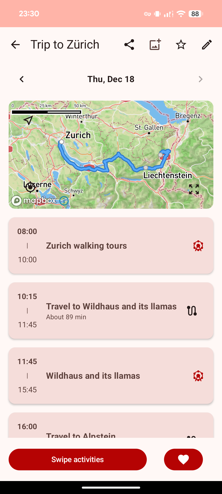
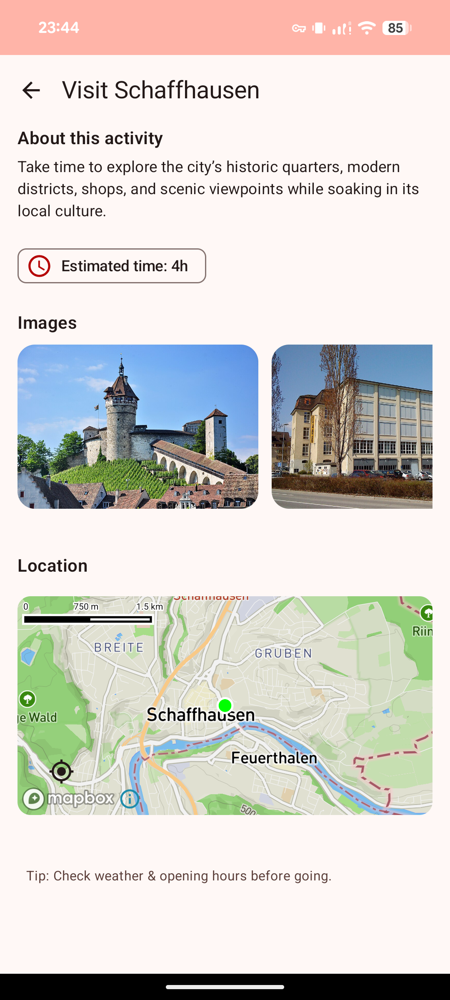
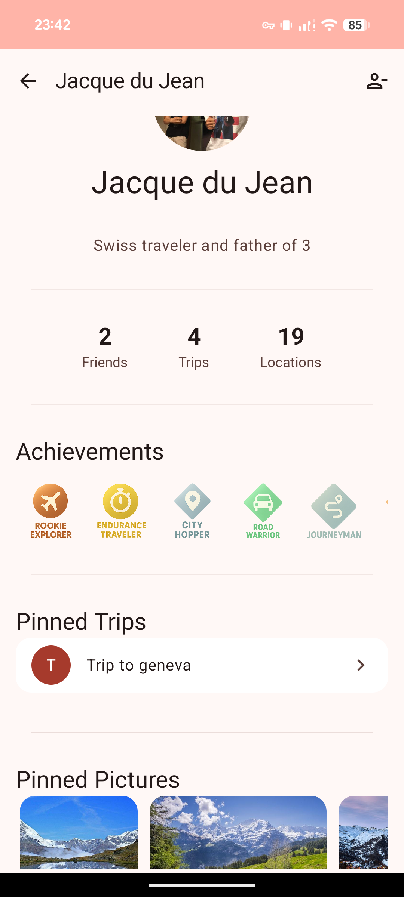
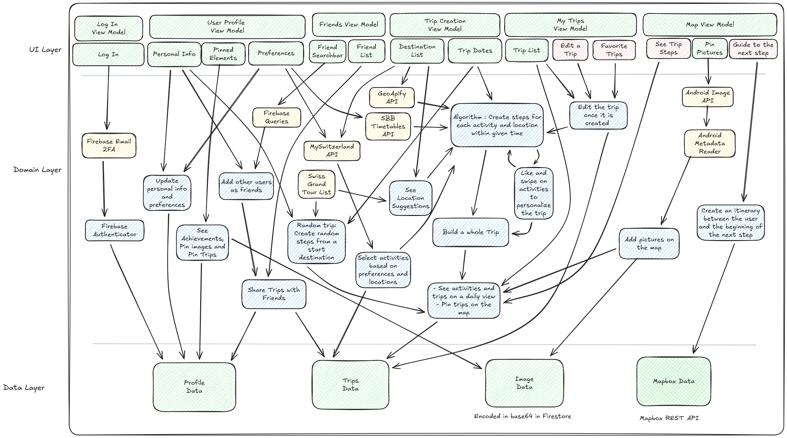

# 🇨🇭 SwissTravel

Switzerland is a country filled with many places to visit, but many tourists don’t know how to plan their trip efficiently. With **SwissTravel**, organising a full trip in Switzerland is easy!

Select a few places you absolutely want to visit, how long you plan to stay, your interests, and let the app sort out everything else. Are you an active traveler? SwissTravel will make sure to fill the gaps in your perfect plan. Or maybe you prefer a more laid-back approach to travelling? SwissTravel will give you a smooth and easy trip to fulfill your needs. Get planning!

### Screenshots

  
   
  
  

---

## ✨ Key Features
### 🗺️ Smart Trip Planning
- **Personalized Itineraries:** Input your must-see locations and interests, and let our algorithm fill in the gaps.
- **Swipe for Activities:** Not sure what to do next? Use our interactive swipe interface to like or dislike activity suggestions, and we'll instantly add your favorites to your plan.
- **Random trips** : Select your travelling style and your starting location, and our algorithm will handle the rest.

### 🚄 Seamless Navigation & Transport
- **Daily Itinerary & Map:** Visualize your generated plan day-by-day with an integrated map that connects your activities and travel segments, giving you a clear overview of your daily route.
- **Offline Access:** Access your full itinerary even without an internet connection.
- **SBB Integration:** Public transport travel times powered by the Swiss Open Transport Data (OJP) API.

### 🤝 Social & Collaboration
- **Connect with Friends:** Search for and add friends to build your travel network.
- **Collaborative Trips:** Invite friends to your trip! Share your itinerary and explore with your close ones.
- **Explore Profiles:** Visit your friends' profiles to view their travel statistics, achievements, and pinned memories.

### 🏆 Gamification & Profile
- **Achievements System:** Unlock unique badges as you explore, based on your activity.
- **Travel Stats:** Track your progress with detailed statistics on total trips, distance travelled, and unique locations visited.
- **Pin Your Memories:** Capture moments and pin photos or favorite trips to your profile to share your journey with the world.

---

## 🏗️ Architecture

The app follows a modern **Model-View-ViewModel (MVVM)** architecture to ensure separation of concerns and testability.

### Core Modules
* **UI Layer:** Built entirely with Jetpack Compose (Material3).
* **ViewModel Layer:** Manages UI state and business logic, bridging the UI and the data layer.
* **Model Layer:**
    * **Repositories:** Abstraction layer for data sources (Firebase, APIs, Local Storage).
    * **Services:** Retrofit services for external API communication.
* **Algorithm Module:** A dedicated package containing the core logic for trip generation. Estimates travel times using the Traveling Salesperson Problem (TSP) to order locations efficiently, minimizing travel time for both Car and Train modes.
* **External APIs:**
    * **Open Transport Data (OJP):** Swiss public transport schedules.
    * **MySwitzerland:** Points of interest and activities.
    * **Geoapify:** Geocoding and location services.
    * **Mapbox:** Mapping and navigation.

### Diagram

  

---

## 📚 Resources
- [Figma Design File](https://www.figma.com/design/nHtmRuMa7ECwq9hGj1oGWT/M3)
- [SwissTravel Wiki](https://github.com/SwEnt-Team10/SwissTravel/wiki)